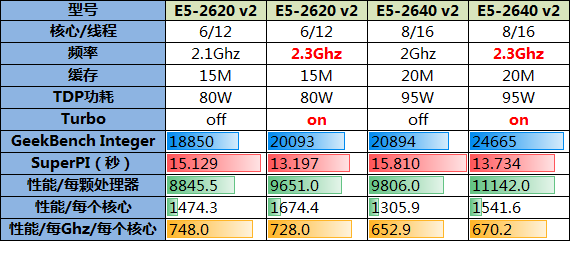
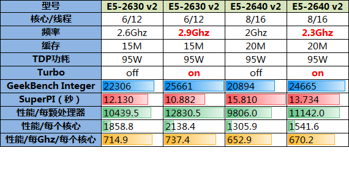

首选我们必须了解处理器的一个简单的性能计算公式：

整体性能 = 单核性能 × 核心数

其次性能受哪些因素影响会有以下这些原则：

原则一：架构越新，单核计算性能越强！

对比同频率、同核心数的前后两代处理器的计算能力就能发现架构越新的处理器整体计算能力也越强，这也意味着处理器架构的改进确实提高了单核性能。

原则二：频率越高，单核计算性能越强！

对比同代同核心数不同频率的处理器就能发现频率越高的处理器计算性能也越好，但这并非完全的线性增长。原因是处理器频率上去以后由于受到内存访问速度的限制也会有一定的瓶颈，而频率越高的处理器耗费在数据等待上的时钟周期也越多。

原则三：核心数越多，整体计算性能越强！

对比同代同频率不同核心数的处理器不难发现核心数越多的处理器整体计算性能也越好。但是如果观察单核性能会发现其实核数越多的处理器单核性能比同频率核数较少的处理器会差一些，主要原因是核数越多对共享资源的争抢概率也越高，这些共享资源包括L3缓存、内存、QPI总线等，这也就是多核处理器总是要把L3缓存做得很大的原因，核数越多L3缓存也越大。

请重点区别单核性能和整体性能：

1、单核性能：它影响的是单线程或者单任务的计算能力（即计算的响应延迟），对于单个请求计算的响应延迟要求较高的应用，就要用高频处理器去满足，而不是用多核。因为应用的一个线程无论任何时候都只能运行在处理器的一个核心上，增加核心数量对于改善单个计算请求的响应延迟并没有帮助，也就是说对跑单线程、单任务的应用无法提升其性能；

2、整体性能：前面提到核数越多整体性能越好，这也意味着多线程和多任务的应用环境下，如果要提高单机的计算处理量最好的办法是增加核心数而不是靠提高频率。理由很简单，核数较少的处理器晶元面积也小。如果要一味提高性能便要提高频率，提高频率其实就是给处理器晶元加电压。晶元能够忍受的电压是有限的，电压耐受力越高的晶元成本也越高。因此从稳定性和成本去考虑的话，晶元面积更大的多核处理器才是提高整体计算能力的最好选择。

下面我们挑选几款主流的双路处理器来作性能分析：

##主题1：核数相同、频率不同

数据说明：如下表所示从第7行（Geekbench Integer）起是各项性能指标：分别是Geekbench整数成绩、SuperPI运行百万次的时间、以及根据Geekbench整数性能分别除以“处理器数量”、“核心数量”、“核心数量和Ghz的乘积”等来分别针对整体性能，单核计算能力，单个处理器、单个核心以及单个核心下每个Ghz的性能进行分析评估。

数据分析：

1、SuperPI体现的是单核浮点性能，通过SuperPI成绩可以发现处理器频率越高单核计算性能也越好，这一点也可以通过“性能/每个核心”项目体现，频率越高单核的计算性能也越好；

2、Geekbench Integer评估的是处理器的整体性能，规律自然也是频率越高整体性能越好；

3、“性能/每Ghz/每个核心”项目评估的是处理器的计算效率，这个项目是将Geekbench的整数成绩按照核数拆分并根据单个Ghz去计算，可以发现核数相同的处理器这个数据相互比较接近。

##主题2：频率相同、核数不同

数据分析：

1、SuperPI项目更加可以说明单核计算能力受频率的影响，虽然2640 v2有8个核心，但对SuperPI的成绩没有丝毫帮助；

2、通过“性能/每个核心”项目可以发现，同频率下核数更少的2620 v2在这项成绩略好一些，即频率相同核数较少的处理器在单核性能上总是会核数更多的处理器略好一些，这确实也验证了核心之间存在资源争抢的假设；

3、Geekbench Integer成绩也体现出多核的性能优势，同频率下核数较多的处理器整体性能也更好；

4、再来看看用以评估计算效率的“性能/每Ghz/每个核心”项目，可以发现核数较多的处理器在计算效率上处于劣势：八核处理器的单核Ghz性能明显要比六核处理器的低不少，这样也进一步验证了核心之间存在资源争抢的假设，并且核数越多资源争抢的现象也越显著。

主题3：整体性能相同

最后一组选取整体性能接近而频率和核数均不同的处理器

数据分析：

1、SuperPI的成绩依旧验证了单核性能只受频率影响的假设；

2、Geekbench Integer成绩说明2630 v2的性能整体略好于2640 v2；

3、通过“性能/每个核心”项依旧验证了频率决定了单核性能的假设；

根据以上数据我们可以进一步将计算公式细化为：

多核处理器的整体计算能力 = 单核Ghz计算能力 × 频率数 × 核数

##结论：

1、处理器整体性能和频率、核数有关，但并非核数越多性能就一定越好，高频少核和低频多核整体性能很可能接近；

2、核数决定了计算承载能力，核数越多能够承载的计算量也越大；

3、频率决定了单核计算能力，频率越高单个计算请求的响应延迟也越低；

4、频率相同的情况下，核数越多单核计算效率也越低；

##参考

http://noops.me/?p=1770
