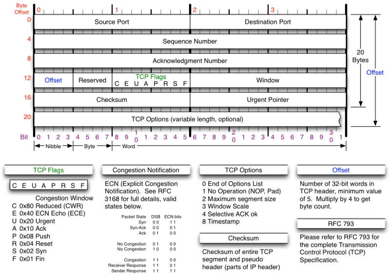
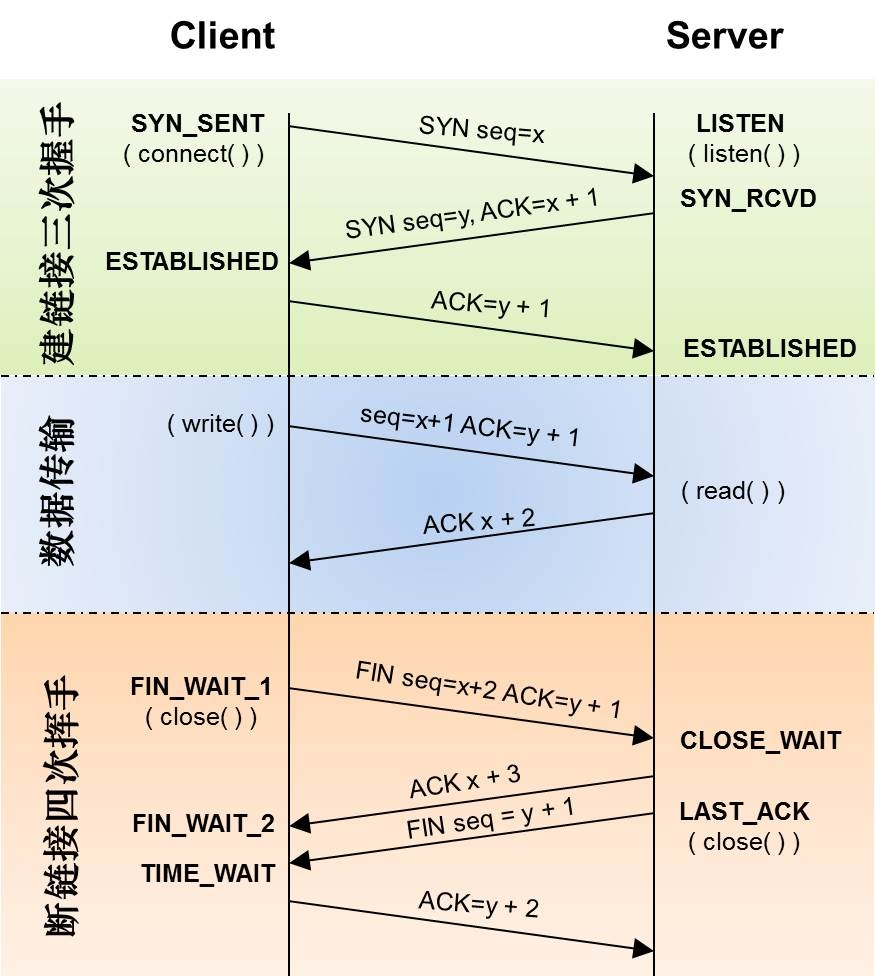
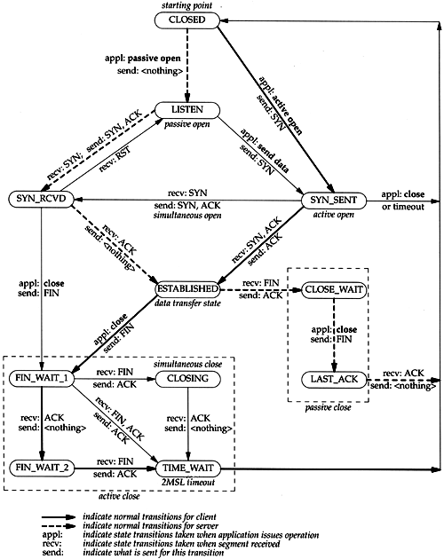
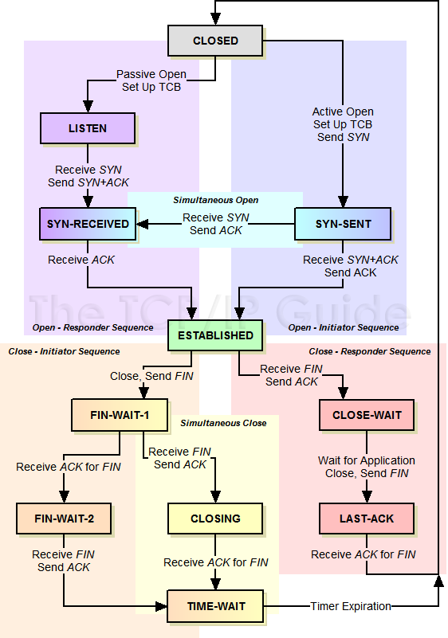

#如何学习 TCP　协议

##入门

##理解概念

TCP 提供一种面向连接的,可靠的,字节流服务.

**面向连接**

两个使用 TCP 的应用在彼此交换数据之前必须建立连接, 对比 UDP

**可靠**

传输前: 数据分片
传输中: 超时重传,流量控制
传输后: 首部校验,失序重排,去重,确认

**字节流服务**

两个应用通过 TCP 连接交换 8 bit构成的字节流. TCP 不在字节流中插入记录标志符,不对字节流内容作任何解释

此外, TCP 为应用层提供全双工服务, TCP 为一个没有选择确认,没有选择否认的滑动窗口协议

##协议格式

##基本原理

###从连接建立,传输数据,到断开连接的状态变化

###连接建立之三次握手过程

####为什么是三次, 不是两次, 四次或更多 ?

要正确回答这个问题, 首先要理解对可靠的约束, TCP 每次发送都是需要对端确认的, 而 UDP 就不需要, 这就本身
表明 TCP 较 UDP 是可靠的. 我相信刨根问底的你, 绝对不会满足这样的回答, 我们继续探讨.

建立连接的过程

1 客户端首先发送请求,请求连接服务器, 等待服务器应答
2 服务器收到客户端请求, 发送应答给客户端
3 服务器发送请求, 告诉客户端已经准备好了
4 客户端收到服务器请求, 发送服务器已经收到

从这里看应该是四次数据交互怎么就成了三次呢? 这里关键是, 将服务器的接受客户端请求, 发送应答, 与发送请求
合并在一起了, 因此, 就减少了一次数据传送, 变成三次. 同理, 关闭连接也是这样, 但是关闭为什么不能是三次呢?
且待下文分析

再回到可靠性上, 到这里, 一定有人在想, 一请一答怎么可能可靠呢?

* 问题一: 如果客户端发送的请求服务的没有收到怎么办?
* 问题二: 如果服务器的应答客户端没收到怎么办?

这不是无穷递归了么? 事实上, 这个问题是不存在的, 原因是, 客户端通过超时来确定请求是否到达客户端, 如果
在一定时间内没有收到服务器的应答, 客户端会重新发送之前的请求, 经过一定的重试次数后，仍然不能成功, 就认为
服务器连接失败, 因此通过超时机制, 只要客户端和服务器是网络可达的, 服务器就一定能收到客户端的请求.
在看问题二, 服务器收到客户端的请求后发送应答, 是不是和问题一的思路一样, 是的, 服务器给客户端发送应答
也是利用超时机制来解决客户端的接收问题. 关于超时机制, 后文会详述.

当然, 至此, 问题似乎已经解决, 其实还没有, 因为, 假设客户端发送请求, 服务器收到了, 服务器发送应答, 客户端
也收到了, 问题是服务器如何确定客户端收到了呢? 是不是要客户端继续发送收到服务器的应答了呢? 这不是还是在
无限循环中么?

这个问题解决办法就是通过发送请求的序列号, 客户端发送请求报文中序列号 N, 服务器收到后应答包中加入 M ACK N+1,
客户端收到服务器的应答报文后, 通过查看 ACK N+1 知道服务的已经收到客户端发送 N 的请求, 发送 N+1:N+X,ACK M+1,
服务器收到客户端的 ACK M+1 知道客户端已经收到服务器的请求, 无限递归问题解决, 两端成功建立连接.

现在你看看上图建立连接的部分是什么样的感觉 ? 顺便思考下, 两次是否可以成功握手, 三次以上就不要考虑了, 因为三
次可以, 你为什么需要四次.

至此, 你已经充分理解, 三次握手是不多不少, 多了是浪费, 少了就不能可靠传输.

当然, 你还会发现 TCP 包首部的 32 位序号和 32 位的确认序号绝不是多余. 这里 32 位长度, 事实上, 在现在的情况下,
32 位长度在有些场合已经遇到瓶颈. 后文再表

###四次断开连接

####为什么是四次结束, 三次不可以么 ?

先看看断开连接的过程:

1 客户端发送 FIN, 表明自己数据已经发送完了(这时客户端还可以接受服务器的数据)
2 服务器收到客户端的 FIN, 应答之
3 服务器的发送 FIN, 表明自己的数据发送完了
4 客户端收到服务器的 FIN, 应答之.

四次, 这里的2, 3 可以合并么? 不可用, 因为, 服务器收到客户端的 FIN, 这时,
服务器可能还有数据要发送, 但数据没有准备好, 于是先把应答发给客户端. 所以2, 3
无法合并. 那为什么握手的2,3可以合并呢? 原因是, 握手时, 双方主要工作是建立连接,
2, 3 之间, 服务器不需要等待或依赖什么, 因此, 2,3 可以合并.

还有一个疑问是, 服务器完全可以等自己的数据准备好了, 再发送应答啊, 这样不就可以
减少为 3 次了么?

TIPS: 对于四次握手, 很多人感觉太冗余了, 因此, 现在很多应用直接 RST 断开连接, 干脆利落

###能读懂 wireshark 中与 TCP 协议相关的所有字段

了解三次握手, 四次分手, 我们来看看, 实际中网络通信的过程, 当然, 神器就是 tcpdump
和 wireshark

* Seq
* Win
* Mss
* Option
* F P U S .

####建立连接

方式:

* 一方主动打开,另一方被动打开
* 双方都主动打开

####断开连接

方式:

* 一方主动关闭,另一方被动关闭
* 双方都主动关闭

* Seq: 最大为 2^32-1, 到达最大值后从 0 开始
* MSS(Maximum Segment Size) : 发送方指明本端能接受的最大报文长度,
通常在通信的第一个报文中指明该字段, 如果一方不接受另一方的 MSS 大小, 默认是 536,
以适应 576 的 IP报文(536 + TCP头 + IP头), 以太网中该值可以为 1460(1500-40)
* SYN: 开始建立连接的第一个包, SYN 置 1
* ACK: 连接建立后,一直为 1, 在应答序列号只有在 ACK 为 1 时才有效
* FIN: 发送端完成数据发送
* RST: 重建连接
* Win: 发送方希望下次接收的数据长度阈值, 最大窗口为 65535, 在现代的网络中, 有时候已经遭遇瓶颈
* URG: 置 1 时, 紧急指针才有效
* PSH: 接收方应该尽快将这个报文交给应用程序, 发送方无法通过编程来设置, 当缓存区清空的时候, 协议栈自动会设置该标志位

###TCP 状态转换

###客户端主动打开, 服务端被动打开

1  客户端发送 SYN 未收到 ACK 时,进入 SYN_SENT
2  服务器收到 SYN, 发送 SYN, ACK 进入 SYN_RCVD
3  客户端收到服务器 ACK, 以及服务器发送的 SYN 后, 发送 ACK 后, 进入 ESTABLISHED
4  服务器收到 ACK, 不发送, 进入 ESTABLISHED
5  客户端和服务器收发数据
6  客户端发送 FIN, 进入 FIN_WAIT_1
7  服务器收到 FIN, 发送 ACK, 进入 CLOSE_WAIT
8  客户端收到 ACK, 不发送, 进入 FIN_WAIT_2
9  服务器发送 FIN, 进入 LAST_ACK
10 客户端收到 FIN, 发送 ACK， 进入 TIME_WAIT
11 服务器收到 ACK, 进入 CLOSED
12 2MSL 超时后进入 CLOSED

###异常情况

1  客户端发送 SYN 未收到 ACK 时,进入 SYN_SENT
2  服务器收到 SYN, 发送 SYN, ACK 进入 SYN_RCVD
3  客户端发送 RST
4  服务端收到 RST, 返回 LISTEN 状态, 等待另一个连接请求到来

###2MSL

当一个 TCP 执行主动关闭, 并发回最后一个 ACK, 该连接必须在 TIME_WAIT 状态停留的时间为 2 倍的 MSL.
这样的好处是让 TCP 再次发送最后一个 ACK 以防这个 ACK 丢失(另一端超时并重传最后的FIN), 缺点是直到
2MSL 结束 这个 TCP 连接在 2MSL 等待期间, 不能再被使用, 一般 2MSL 为 4 分钟,实现常是 1 分钟或 30 秒

1. 如果是客户端执行主动关闭, 2MSL 没有什么影响, 因为客户端不会端口重用,而且端口是不固定的
2. 如果是服务端主动关闭, 2MSL 就可能产生影响, 因为服务器一般都是绑定到固定端口

验证

1. 服务器启动一个服务(绑定 8000 端口), 客户端连接服务器, 然后停止服务, 重启服务
2. 客户端连接服务器绑定到固定端口(9000), 连接服务器, 然后, 关闭客户端, 重新连接服务器
3. 服务器启动服务(绑定8000d端口), 客户端绑定(9000)端口, 连接服务器, 主动关闭服务器, 然后以服务器的
8000 端口为客户端, 客户端的 9000 端口为服务端口, 服务器连接客户端的 9000 端口
4. 在 3 中，服务器连接客户端的时候打开 SO_REUSEADDR
5. 在 1 中, 启动服务器时打开 SO_REUSEADDR.

###RST

* 到不存在的端口
* 异常终止一个连接 SO_LINGER
* 半打开连接: 客户端掉电, 服务器重启,客户端重新发送数据

半关闭: 例如远程执行命令
平静时间:
同时打开: 既是服务器又是客户端
同时关闭: 同时 FIN
TCP 选项:

**注**

* MSL(Maximum Segment Lifetime)
* 两个导致进入 ESTABLISHED 的状态变迁对应打开一个连接, 两个导致从 ESTABLISHED 离开的变迁对应关闭一个连接
* CLOSED 不是一个真正的状态, 而是一个假想的起点和终点

此外, 还有如下零碎的知识点;

1. src_ip, src_port, dst_ip, dst_pot 为四元组, 唯一标志一个 TCP 连接
2. src_ip, src_port, protocol, dst_ip, dst_port 为我们常说的五元组, 唯一标志一个连接
3. 连接建立开始的序号叫 ISN (initial Sequence Number), 即初始序列号, 绝不是从抓包软件中看到的从 0 开始, 此外这个需要是 2的 32 次方
4. 连接建立和连接终止时, TCP 数据部分为 0, 因此 TCP 报文数据部分是可选的
5. 校验和是强制性的
6. 首部没有可选字段, 为20 个字节, 包含可选字段最大为 60 字节(4 * 15)
7. TCP 接受一个连接将其放入队列, 而应用层接受连接是将其从队列中取出
8. TCP 确认仅仅表明TCP已经正确接受了数据

至此, 你可以在简历上说了解 TCP 了. 但要说熟悉, 还需要下文的帮助

##熟悉

##TCP 窗口

* MTU
* MSS
* 发送窗口
* 接受窗口(receiver window（rwnd）): 也叫通告窗口,可变,即滑动窗口, 接收方的流量控制
* 拥塞窗口cwnd: 发送方的流量控制
* 路径MTU
* 延迟确认
* Nagle算法
* 滑动窗口(sliding window): 窗口张开, 窗口合拢, 窗口收缩
* 通告窗口(awnd 是 advised window)

它们相互之间的关系

 MTU = MSS + 40

###MSL 与 Seq 的关系

RFC793 中说, ISN 会和一个假的时钟绑在一起, 这个时钟会在每 4 微秒对 ISN 做加一操作, 直到超过 2^32，又从 0 开始. 这样,
一个 ISN 的周期大约是 4.55 个小时. 因为, 我们假设我们的 TCP Segment 在网络上的存活时间不会超过 Maximum Segment Lifetime
（缩写为MSL – Wikipedia语条）. 所以，只要 MSL 的值小于 4.55 小时, 那么, 我们就不会重用到 ISN.

###MSL 与 TIME_WAIT 的关系

##重传

关于重传, 必然是出现了不期望的结果, 那么, 有哪些不期望的结果, 我们一一列出

###握手阶段

1  客户端向服务器发送 SYN 请求, 服务器一直没有收到客户端的 SYN 请求

2  客户端向服务器发送 SYN 请求, 服务器收到客户端的 SYN 请求, 但是服务器没有应答

3  客户端向服务器发送 SYN 请求, 服务器收到客户端的 SYN 请求, 服务器发送 ACK 和自己的 SYN 请求, 但客户端一直没有收到服务器应答

4  客户端向服务器发送 SYN 请求, 服务器收到客户端的 SYN 请求, 服务器发送 ACK 和自己的 SYN 请求, 客户端收到服务器的应答, 但没有应答服务器的 SYN 请求

5  客户端向服务器发送 SYN 请求, 服务器收到客户端的 SYN 请求, 服务器发送 ACK 和自己的 SYN 请求, 客户端收到服务器的应答, 向服务器发送 ACK, 但是服务器一直没有收到客户端的应答

6  客户端向服务器发送 SYN 请求, 服务器收到客户端的 SYN 请求, 服务器发送 ACK 和自己的 SYN 请求, 客户端收到服务器的应答, 向服务器发送 ACK, 服务器收到客户端的应答

对于情况4, 就会出现常见的 syn flood 攻击, 试想, 如果一个客户端发送大量的请求, 但是都不应都服务器的 SYN, 服务器就只能等超时, 在超时阶段,
该客户端就一直占有这个连接, 如果超时时间很长, 服务器的 SYN 队列很快就满了, 无法处理其他正确的请求.

Linux 下解决办法是设置 tcp_syncookies 的参数 —— 当 SYN 队列满了后，TCP 会通过源地址端口, 目标地址端口和时间戳打造出一个特别的 Sequence Number
发回去(又叫cookie), 如果是攻击者则不会有响应, 如果是正常连接, 则会把这个 SYN Cookie 发回来, 然后服务端可以通过 cookie 建连接(即使你不在 SYN
队列中). 请注意, 请先千万别用 tcp_syncookies 来处理正常的大负载的连接的情况. 因为, synccookies 是妥协版的 TCP 协议, 并不严谨. 对于正常的请求,
你应该调整如下三个参数来处理这种攻击

    tcp_synack_retries    可以用他来减少重试次数;
    tcp_max_syn_backlog   可以增大SYN连接数;
    tcp_abort_on_overflow 处理不过来干脆就直接拒绝连接了。

###数据传送阶段

1 客户端发送请求, 服务器没有收到客户端的请求
2 客户端发送请求, 服务器收到客户端的请求, 但服务器没有应答客户端的请求
3 客户端发送请求, 服务器收到客户端的请求, 服务器应答客户端的请求, 但客户端没有收到

###分手阶段

1. 客户端发送 FIN, 服务器没有收到客户端的 FIN 请求

2. 客户端发送 FIN, 服务器收到了客户端的 FIN 请求, 但没有 ACK

3. 客户端发送 FIN, 服务器收到了客户端的 FIN 请求, 发送 ACK, 客户端没有收到服务器的 ACK

4. 客户端发送 FIN, 服务器收到了客户端的 FIN 请求, 发送 ACK, 客户端收到了服务器的 ACK, 但服务器一直没有发送 FIN

5. 客户端发送 FIN, 服务器收到了客户端的 FIN 请求, 发送 ACK, 客户端收到了服务器的 ACK, 服务器发送 FIN, 但客户端一直没有收到服务器的 FIN 请求

6. 客户端发送 FIN, 服务器收到了客户端的 FIN 请求, 发送 ACK, 客户端收到了服务器的 ACK, 服务器发送 FIN, 但客户端收到服务器的 FIN 请求, 没有发送 ACK

7. 客户端发送 FIN, 服务器收到了客户端的 FIN 请求, 发送 ACK, 客户端收到了服务器的 ACK, 服务器发送 FIN, 但客户端收到服务器的 FIN 请求, 发送 ACK, 但服务没有收到客户端的 ACK

8. 客户端发送 FIN, 服务器收到了客户端的 FIN 请求, 发送 ACK, 客户端收到了服务器的 ACK, 服务器发送 FIN, 但客户端收到服务器的 FIN 请求, 发送 ACK, 服务收到客户端的 ACK

* 延迟确认: 收到数据后直到有数据要回复或者延迟一定时间(200ms)，才确认
* Nagle 算法: 收到数据后直到有数据要回复或者数量满 1 个MSS，才确认, (TCP_NODELAY 关闭该算法)
* 糊涂窗口综合症: 窗口更新发生于窗口大小增加了两个 MSS 或最大接受窗口的 1/2 时,发送窗口更新
* SACK
* Karn / Partridge Algorithm
* Jacobson / Karels Algorithm RFC6289
* Zero Window
* David D Clark’s 方案

##拥塞控制

* RTT:
* RTO 计算方法 A+2D -> A+4D

* 拥塞避免: 慢启动到达临界窗口值，每个往返时间增加 1 个 MSS
* 慢启动: 每收到 n 个确认就把拥塞窗口增加 n 个 MSS
* 快速恢复: 临界窗口值为没有确认包的数据量的 1/2 (不小于 2 MSS), 拥塞窗口设置为临界窗口值加 3, 继续保留在拥塞避免阶段

* 超时重传: 拥塞避免阶段
* 超时重传对拥塞窗口和临界窗口值的影响 : 临界窗口值为没有确认包的数据量的 1/2 (不小于 2 MSS), 拥塞窗口降为 MSS
* 快速重传: 拥塞避免阶段,收到 3 个重复的 ack(表明包丢了); 为什么要 3 个，完全是经验值，为了与乱序区别开来
* 快速重传对拥塞窗口和临界窗口值的影响 : 快速恢复

* TCP Reno
* TCP New Reno

##临界窗口(ssthresh)的确认

* RFC 2001 丢包时的一半大小
* Westwood : 作者 Saverio Mascolo, 适用于经常发送非拥塞性的丢包环境(无线)
* Vega : 通过 RTT 来调整临界窗口值
* Compound : Windows
* BIC
* CUBIC
* HSTCP(High Speed TCP) 算法

对于多个丢包, 更好的解决办法:

* NewReno: RFC 2582, RFC 3782
* SACK   : RFC 2018

* SO_REUSEPORT
* SO_REUSEADDR

##精通

关于TIME_WAIT数量太多。从上面的描述我们可以知道，TIME_WAIT是个很重要的状态，但是如果在大并发的短链接下，TIME_WAIT
就会太多，这也会消耗很多系统资源。只要搜一下，你就会发现，十有八九的处理方式都是教你设置两个参数，一个叫tcp_tw_reuse，
另一个叫tcp_tw_recycle的参数，这两个参数默认值都是被关闭的，后者recyle比前者resue更为激进，resue要温柔一些。另外，
如果使用tcp_tw_reuse，必需设置tcp_timestamps=1，否则无效。这里，你一定要注意，打开这两个参数会有比较大的坑——可能会让
TCP连接出一些诡异的问题（因为如上述一样，如果不等待超时重用连接的话，新的连接可能会建不上。正如官方文档上说的一样
“ It should not be changed without advice/request of technical experts”）。

关于tcp_tw_reuse。官方文档上说tcp_tw_reuse 加上tcp_timestamps（又叫PAWS, for Protection Against Wrapped Sequence
Numbers）可以保证协议的角度上的安全，但是你需要tcp_timestamps在两边都被打开（你可以读一下tcp_twsk_unique的源码
）。我个人估计还是有一些场景会有问题。

关于 tcp_tw_recycle。如果是 tcp_tw_recycle 被打开了话，会假设对端开启了 tcp_timestamps，然后会去比较时间戳，如果
时间戳变大了，就可以重用。但是，如果对端是一个 NAT 网络的话（如：一个公司只用一个 IP 出公网）或是对端的 IP 被另一
台重用了，这个事就复杂了。建链接的SYN可能就被直接丢掉了（你可能会看到connection time out的错误）（如果你想观摩一下
Linux的内核代码，请参看源码 tcp_timewait_state_process）。

关于tcp_max_tw_buckets。这个是控制并发的TIME_WAIT的数量，默认值是180000，如果超限，那么，系统会把多的给destory掉，
然后在日志里打一个警告（如：time wait bucket table overflow），官网文档说这个参数是用来对抗DDoS攻击的。也说的默认
值180000并不小。这个还是需要根据实际情况考虑。

建立起连接后，这就意味着五元组[src IP, dst IP, src Port, dst Port, Protocol]已经确定并和某个进程pid绑定，
这个五元组会被加入到内核里面的sock hash表里，通过这个hash表后续连接就知道这个已存在的连接到底是绑定在哪个
进程pid上的，而后续报文都会发送到这个pid，不至于导致连接混乱。

##参考

* [RFC5681](http://tools.ietf.org/html/rfc5681)
* [RFC6582](http://tools.ietf.org/html/rfc6582)
* TCP/IP 详解卷一
* Wireshark 网络分析就这么简单
[RFC 793](http://tools.ietf.org/html/rfc793)
[RFC 1122](http://tools.ietf.org/html/rfc1122)
[RFC 6298](http://tools.ietf.org/html/rfc6298)
[RFC 3990](http://www.rfc-editor.org/rfc/rfc3390.txt)
[RFC 3649](http://tools.ietf.org/html/rfc3649)
[linux tcp 相关配置选项](https://www.kernel.org/doc/Documentation/networking/ip-sysctl.txt)
[RFC 2018](http://tools.ietf.org/html/rfc2018)
[RFC 2883](http://www.ietf.org/rfc/rfc2883.txt)
[SACK 性能权衡](http://www.ibm.com/developerworks/cn/linux/l-tcp-sack/)
[TCP那些事上](http://coolshell.cn/articles/11564.html)
[TCP那些事下](http://coolshell.cn/articles/11609.html)
[拥塞避免算法列表](https://en.wikipedia.org/wiki/TCP_congestion-avoidance_algorithm)

附录
SYN(Synchronize Sequence Numbers)
ISN(Inital Sequence Number)
滑动窗口(sliding window)
ssthresh（slow start threshold）
